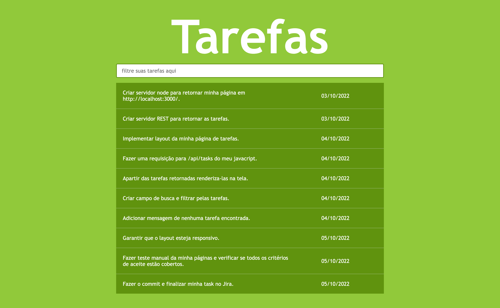
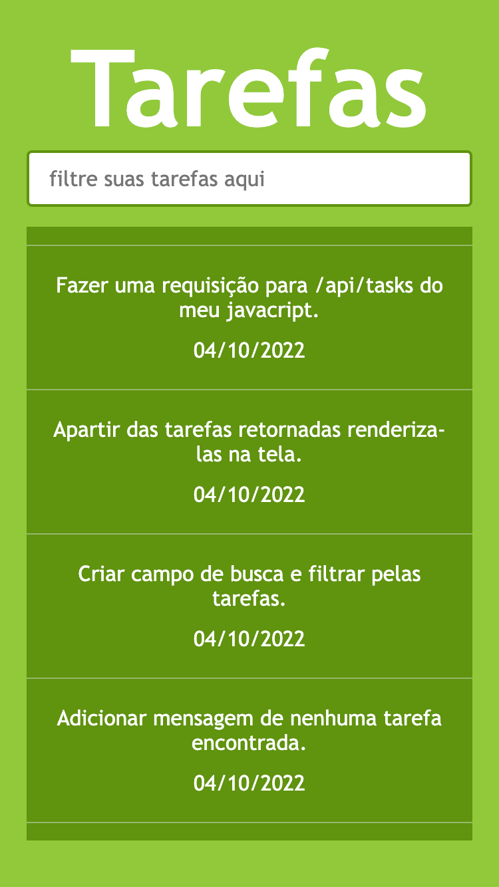
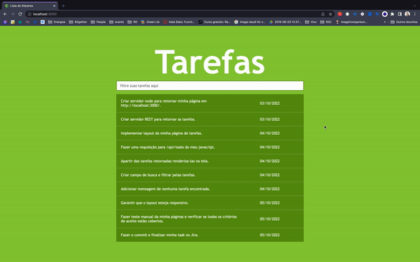

# dev-web-vanilla

O objetivo de fazer esse projeto é entender os conceitos fundamentais e de base do desenvolvimento
web sem utilizar frameworks auxiliares.

## Projeto
Você deve ser capaz de criar um servidor com node.js que irá servir seu arquivo html, assets e também uma API REST que será responsável por retornar ao
front-end uma lista de tarefas. Também irá implementar um front-end que deve renderizar essa lista de tarefas permitindo que os dados sejam filtrados pelo usuário.

## Tecnologias e Linguagens

- [Javascript](https://developer.mozilla.org/en-US/docs/Web/JavaScript)
- [Node.js](https://nodejs.org/en/docs/)
- [YARN](https://yarnpkg.com/getting-started)
- [HTML](https://developer.mozilla.org/pt-BR/docs/Web/HTML)
- [CSS](https://developer.mozilla.org/pt-BR/docs/Web/CSS)

Obs.: não se esqueça de iniciar o yarn na raiz do seu projeto e lembre-se a ideia é não utilizar nenhuma dependência externa na primeira versão, se depois de finalizar você quiser adicionar libs e frameworks para implementar as melhorias fique a vontade.

Dica: os links acima são para as documentações das tecnologias, quando ficar na dúvida use a documentação para te ajudar.


## Organização

Na raiz do seu projeto você deve ter duas pastas uma chamada `server` onde ficará o código em node.js do seu servidor e outra chamada `client`
onde ficará seu código do front-end.
```
server
└── index.js
client
├── favicon.ico
├── index.html
├── main.css
└── main.js
package.json
```

## Servidor
Use as libs nativas do node.js, como o http, para criar seu servidor no arquivo server/index.js. Ele deve ouvir por padrão a porta
3000 no localhost.

Crie um script start no package.json que irá iniciar o servidor executando o arquivo server/index.js com node, assim você poderá usar o comando `yarn start` no seu terminal sempre que precisar reiniciar o servidor.

### Static Files

Quando o usuário acessar http://localhost:3000/ deve visualizar a página inicial de tarefas, ou seja, deve carregar
o client/index.html.

Você também deve disponibilizar os outros arquivos do client através do servidor, desta forma será possível
carregar o arquivo client/favicon.ico através da url http://localhost:3000/favicon.ico por exemplo.

### API

Crie a rota /api/tasks (http://localhost:3000/api/tasks) que deve retornar um json com as tarefas, você pode usar os dados de exemplo abaixo:

```
[
    { description: "Criar servidor node para retornar minha página em http://localhost:3000/.", targetDate: '03/10/2022' },
    { description: "Criar servidor REST para retornar as tarefas.", targetDate: '03/10/2022' },
    { description: "Implementar layout da minha página de tarefas.", targetDate: '04/10/2022' },
    { description: "Fazer uma requisição para /api/tasks do meu javacript.", targetDate: '04/10/2022' },
    { description: "Apartir das tarefas retornadas renderiza-las na tela.", targetDate: '04/10/2022' },
    { description: "Criar campo de busca e filtrar pelas tarefas.", targetDate: '04/10/2022' },
    { description: "Adicionar mensagem de nenhuma tarefa encontrada.", targetDate: '04/10/2022' },
    { description: "Garantir que o layout esteja responsivo.", targetDate: '05/10/2022' },
    { description: "Fazer teste manual da minha páginas e verificar se todos os critérios de aceite estão cobertos.", targetDate: '05/10/2022' },
    { description: "Fazer o commit e finalizar minha task no Jira.", targetDate: '05/10/2022' }
]
```

Mas também experimente adicionar mais itens nessa lista de tarefas ou criar sua própria lista.

## Critérios de aceite

- Quando a página é montada deve exibir todas as tarefas
- Deve possuir um campo para filtrar as tarefas listadas quando o usuário apertar a tecla enter
- Deve exibir uma mensagem de tarefas não encontradas quando não tiver nenhuma tarefa para o filtro
- Quando o usuário limpar o campo de filtro deve mostrar todas as tarefas

## Protótipo

Deve ter um layout responsivo conforme os protótipos abaixo:

### Desktop


### Mobile


### Comportamento



## Melhorias

Agora que você aprendeu a disponibilizar os static files (html/css/imagens) sem frameworks, experimente usar o [express](https://expressjs.com/), 
para aproveitar a facilidade dele.

Você também pode adicionar a opção de criar novas tarefas apartir da tela e rota POST /api/task persistindo as tarefas em um .json por exemplo.
